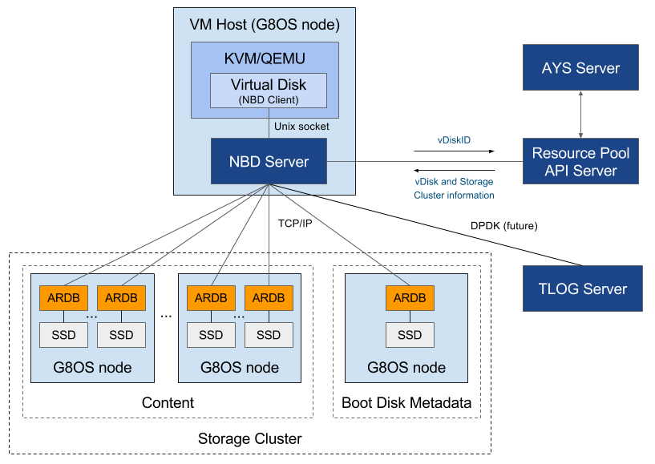

# NBD Server

NBD, abbreviation for Network Block Device, is the lightweight block access protocol used in a G8OS resource pool to implement block storage.

A NBD Server actually implements the NBD protocol. For each virtual disk one NBD Server will be created. Each of these NBD Severs, or volume driver servers, runs in a separate container, and depends on another container that implements the TLOG Server.

Next:
- [Building your NBD Server](building.md)
