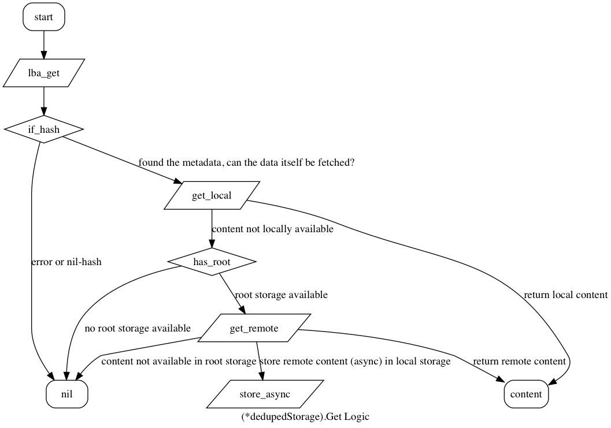

# Backend Storage

All backend and storage code can be found in the [ARDB][ardb] sub module.

[The Backend][ardb.backend] is used for _all_ nbdserver's incoming NBD requests. The underlying storage however can be different.

## Deduped Storage

[The Duduped Storage][ardb.deduped] stores an [LBA][lba] hashmap per [vdisk][vdisk]. The blocks of the content are stored directly into storage, identified by their representative [Blake2B Hash][blake2b.hash]. Deduped [vdisks][vdisk] don't access this content directly. Instead the content is accessed via the [vdisk][vdisk]'s [LBA][lba]. When an operation is wanted on a block, this is done via its index (the block index). In the [LBA][lba]'s hashmap, we can find maximum one hash per index. In case an index has no content, it is linked to a [NilHash][lba.nilhash] instead (which is zero-filled).

Let's visualise the simplest operation that can be applied onto a block, getting the content:



In the flow graph above we can see the deduped [vdisk][vdisk]'s main logic theme in action. When retrieving a block we'll always first need to retrieve the hash (identifying the content), before fetching the content (locally or remotely) itself.

When setting (`Set`), modifying (`Merge`) or deleting (`Delete`) the content, we'll access the [LBA][lba] first, in order to get the current Hash. With this hash in hand, we'll delete the content itself. And only then we set, replace or delete the hash itself. This order helps to guarantee that the deduped [vdisk][vdisk]'s [LBA][lba] points to existing content.

Note that the (read-only) root storage is only accessed when content is fetched (which is not available in the local storage). The NBDServer never sets, merges or deletes content stored in the root storage.

This storage is called deduped, because no duplicated content is stored. [Hash][blake2b.hash] collisions would overwrite existing content, and could lead to data corruption. Undesired as this is however, it is not likely to happen, due to the fact that not all content is stored in the same ardb, and instead spread over an entire cluster.

It is possible (and in fact desired), that multiple block indices of the (same or different) [vdisk][vdisk] point to the same [hash][blake2b.hash] and thus content.

Each time a block is referenced by an index in a [vdisk][vdisk]'s LBA, the reference counter for that content is increased. When a block in a [vdisk][vdisk]'s LBA is "deleted", the actual content isn't deleted and instead simply dereferenced. When a block is dereferenced the reference counter for that content is decreased. When the reference counter for a block reaches 0, the content itself is permanently deleted from the (local) storage.

See [the deduped code](../ardb/deduped.go) for more information.

## Nondeduped Storage

Not all [vdisks][vdisk] managed by the NBDServer are deduped. Databases and caches are stored as nondeduped [vdisks][vdisk] for example.

Nondeduped [vdisks][vdisk] store, modify, access and delete their content directly in/from the local storage. Each content (block) is identified by the block index itself, within the namespace of the [vdisk][vdisk]:

```
key = `<vdiskid>:<blockIndex>` # Eg.: `foo:42`
key => $block # a block is a raw byte slice
               # a fixed length (the predefined block length)
```

This makes the [nondeduped storage][ardb.nondeduped] and its operation very straightforward. 

See [the nondeduped code](../ardb/nondeduped.go) for more information.

[ardb]: ../ardb
[ardb.backend]: ../ardb/backend.go#L10-L16
[ardb.deduped]: ../ardb/deduped.go#L23-L32
[ardb.nondeduped]: ../ardb/nondeduped.go#L18-L25
[lba]: ../lba
[lba.nilhash]: ../lba/hash.go#L15-L16
[vdisk]: https://en.wikipedia.org/wiki/Virtual_disk
[blake2b.hash]: ../lba/hash.go#L19-L20